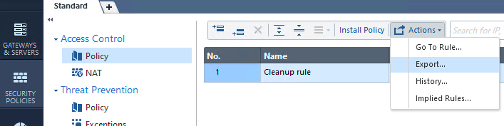
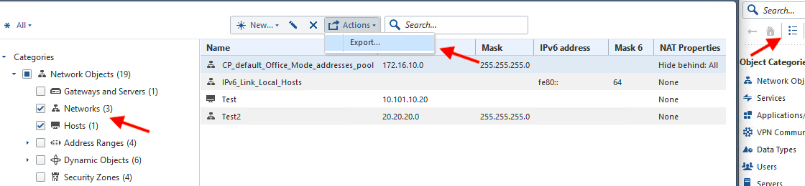

Checkpoint conversion
######################

It is tested on SmartConsle **CSV**  policy and address object exporting format.
Because of insufficient information on csv output, Service part does not have protocol part to understand wheter it is TCP/UDP and Service conversion not implemented yet.

|

File Base
*********

Here are steps to provide correct output file from Check Point:

**Policy**:

- Login to SmartConsole, go to **Security Policies**.
- Click on actions and select export.

|

**Objects**:

- Login to SmartConsole, on the right panel find 3 dots on toolbar and click.
- Select Networks and Hosts section from left selection part
- Click actions and select export.

|

Final step
**********

Got to `After conversion <final.html>`_ 