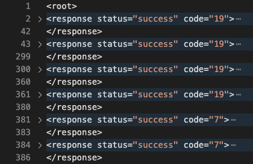

Palo Alto conversion
####################

As Palo alto supports XML output format, here is the steps for getting config and policy fro PAN-OS:

File Base
*********

**Policy and Config**

- Login to PAN-OS through cli or console.
- Execute ``set cli config-output-format xml`` command
- Enter to config mode with ``configure``
- Execute ``show`` command
- Copy the output into file 
- Supported file extensions is .log and .txt
- Because of Palo Alto XML formatted that is not standard, it is important to wrap up entire output with <root> and </root> tag.

|

Final step
**********

Got to `After conversion <final.html>`_ 