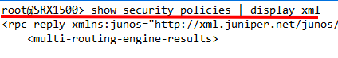
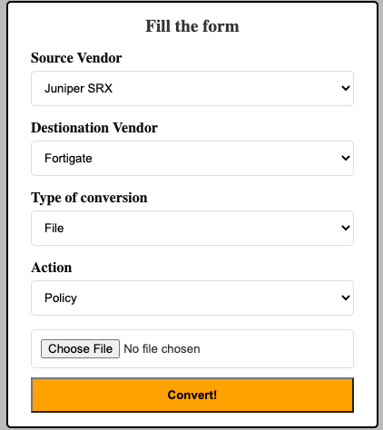
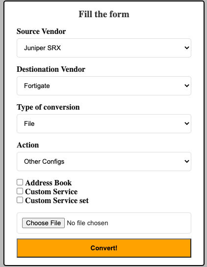
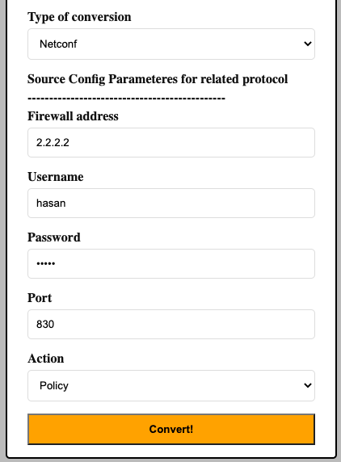

SRX conversion
##############

It is tested on Junos 12.x , 15.x , 18.x and it uses XML format to convert configs and policies.
Policies can not be extracted from SRX configuration output, because it does not provide **rule order** . So, from ``show security policies`` it can find out rule/policy orders.

Features
========
- Address books (Global and Policy based)
    - Name
    - Description

- Services and Service Groups
    - Name
    - Description
    - Source and Destination port
    - Session timeout

|

File Base
*********

If you want to get the SRX device configs and policies manually, you need to select ``file`` under ``Type of conversion`` section and you can follow below steps to do conversion without any error.

SRX config and policy
=====================

Here are steps to provide correct output file from SRX devices:

**Policy**:

- Login to SRX and execute :code:`show security policies | display xml`
- Copy the output into file
- Make sure only XML output is in the file
- Supported file extensions is .log and .txt

**General configs**:

- Login to SRX and execute :code:`show configuration | display xml`
- Copy the output into file
- Make sure only XML output is in the file
- Supported file extensions is .log and .txt

For example if file starts or ends with some not xml lines please remove them. In below figure you can see first line is not xml formatted:

It is important to note that after conversion steps, you must paste output files of configuration first. Because, policies uses network/service objects and if they are not available on destination device, policies will be failed.

Using conversion
================

After `SRX Config and policy`_ steps, you can upload file through web UI. For policy conversion you should choose ``policy`` option under ``Action`` on web UI and upload policy XML formatted file to upload. However, if you choose ``other configs``, new options will be available for Address Books, Services and Service-groups to provide better result. You can see below figure for both options.

|

Netconf
*******

You can use Netconf for conversion in fwmig. It will connect to the srx device and read configs or policies and then it will converts to destination vendor. You need to provide access for fwmig on Netconf port (TCP/22 or TCP/830) on SRX device. Below figure is example of Netconf conversion:

|

Final step
**********

Go to `After conversion <final.html>`_ 